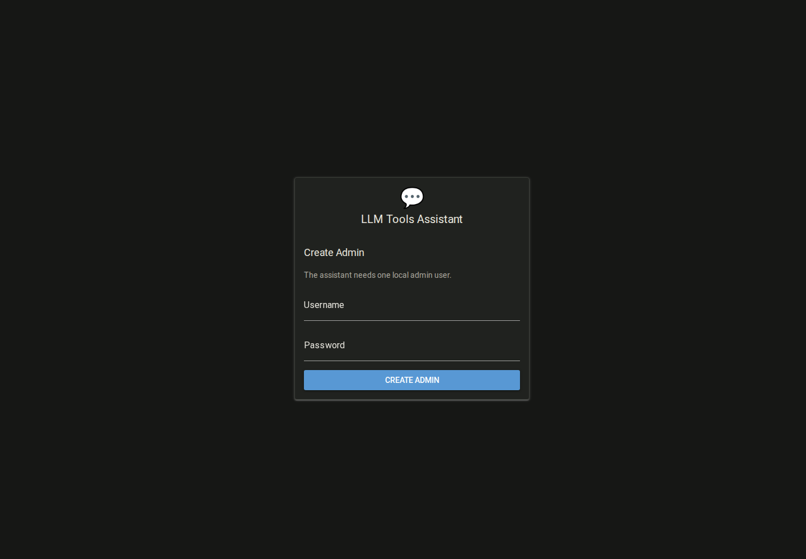
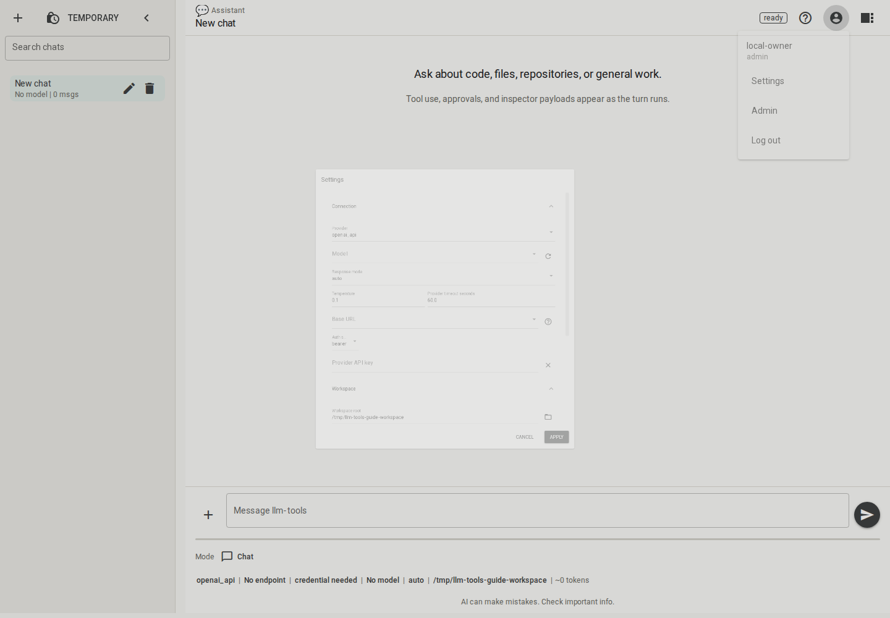
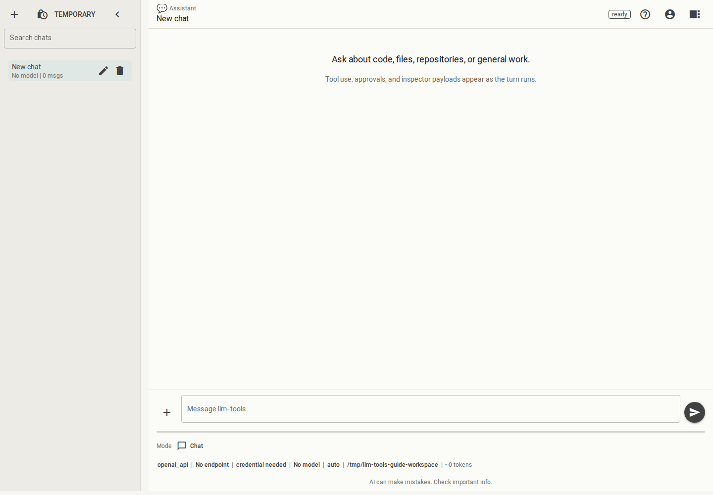
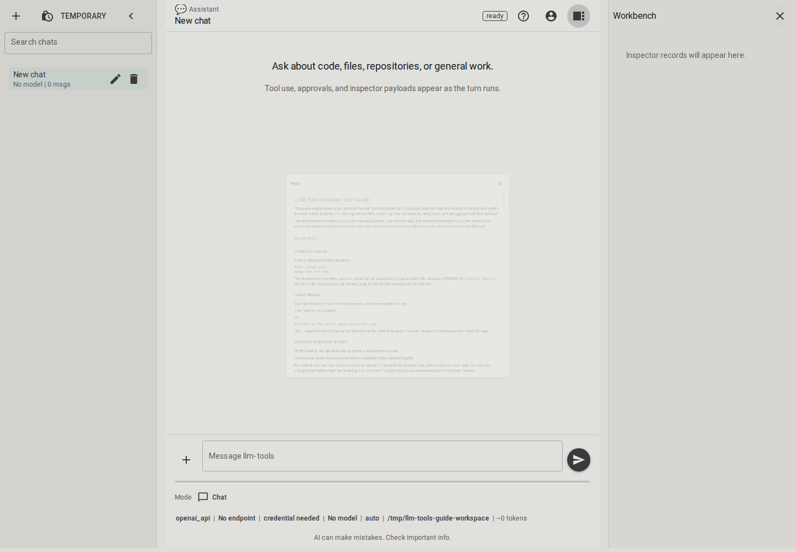
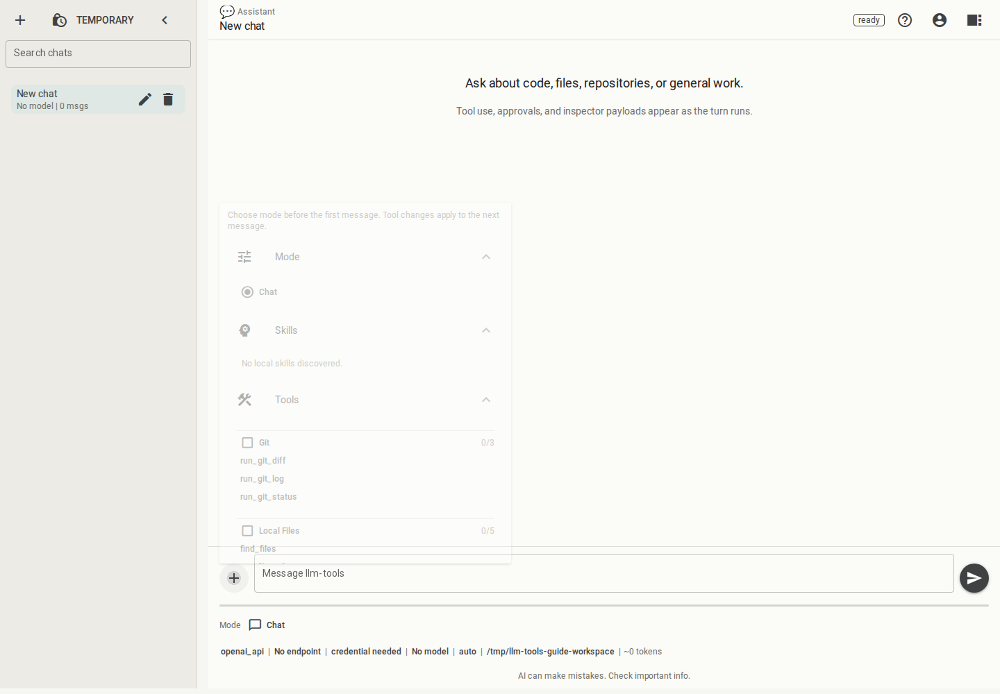
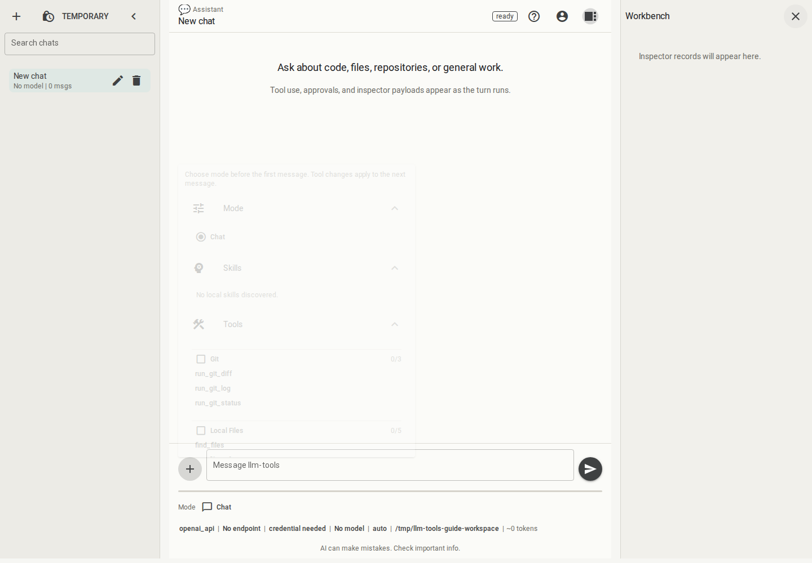

# LLM Tools Assistant User Guide

This guide explains how to run and use the LLM Tools Assistant as a local,
solo assistant app. It is written for people who want a browser-based assistant
for chatting with models, inspecting local workspaces, using tools, and
debugging model/tool behavior.

The documented workflow is local use: one app process, one browser user, and one
local workspace at a time. Some code paths and settings exist for hosted or
multi-user operation, but hosted mode is not a documented product workflow yet.

## Quick Start

### Install from source

From a checkout of this repository:

```bash
make setup-venv
make install-dev
```

The development workflow uses the shared virtual environment documented in the
repository README. Re-run `make install-dev` from the checkout you are actively
using so the editable install points at that tree.

### Launch the app

Start the Assistant from the workspace you want the assistant to use:

```bash
llm-tools-assistant .
```

or:

```bash
python -m llm_tools.apps.assistant_app .
```

The `.` argument selects the current directory as the initial Workspace. You can
change the Workspace later inside the app.

### Create the local owner account

On first launch, the app asks you to create a local admin account.



For normal solo use, this is your local owner account. It protects the browser
app, unlocks your per-user data, and lets you change local feature flags and
branding. It is not meant to imply that you are administering a hosted team
service.

### Configure your first provider

After signing in, open provider settings from the header or Settings dialog and
choose a provider endpoint, auth scheme, response mode, and model.



For a first local setup, use the `OpenAI API` provider protocol even for many
non-OpenAI endpoints. The protocol means "OpenAI-compatible API shape," not
necessarily the OpenAI service.

Good starting points:

| Endpoint type | Provider | Base URL | Auth scheme | Response mode |
| --- | --- | --- | --- | --- |
| OpenAI API | `OpenAI API` | `https://api.openai.com/v1` | `bearer` | `auto` |
| Ollama OpenAI-compatible | `OpenAI API` | `http://127.0.0.1:11434/v1` | `none` | `auto` |
| Local OpenAI-compatible server | `OpenAI API` | Use the server's local API URL | usually `none` | `auto` |
| Enterprise gateway | `OpenAI API` | Ask the gateway owner | ask the gateway owner | `auto` or recommended setting |

Model ids must match the selected endpoint. If discovery fails, you can still
type a model id manually when you know it is valid.

### Send a message

Use the composer at the bottom of the main screen. Press Enter to send and
Shift+Enter for a newline. When a turn is running, the send button becomes a
stop button.



## Assistant Tour

The app has a compact ChatGPT-like layout.

- **Chat rail**: create a new chat, create a Temporary Chat, search recent
  sessions, rename sessions, and delete sessions.
- **Header**: shows the current chat title, status, account menu, Help button,
  and Workbench toggle.
- **Transcript**: shows user messages, assistant messages, tool/status records,
  and final-answer details.
- **Composer**: accepts prompts, shows context usage, selected mode, selected
  tools, and the current provider/workspace summary.
- **Settings**: controls provider, model, response mode, workspace, display,
  permissions, limits, persistence, and credentials.
- **Workbench**: inspector surface for provider messages, parsed responses, tool
  executions, and timing/debug payloads.
- **Help**: the question mark button opens this user guide inside the app.



## Everyday Chat

### Persistent chats

Normal chats are saved to the local encrypted Assistant database. They appear in
the chat rail and keep their transcript, runtime settings, token summary, and
Workbench records.

Use the edit and delete buttons in the chat rail to rename or remove saved
sessions.

### Temporary chats

Temporary Chat uses the same model, tool, permission, and credential behavior as
a normal chat, but it is not written to durable Assistant persistence and does
not appear in recent sessions.

Temporary does not mean incognito. Provider calls, browser behavior, operating
system access, and tool-visible side effects still behave normally.

### Copy, regenerate, stop, and follow up

Assistant messages include a copy button and a regenerate button. Copy writes
the assistant message text to the browser clipboard. Regenerate reruns the last
user prompt in the current chat context.

When a turn is active, the composer action becomes Stop. Stop requests
cancellation; depending on timing, the transcript may show an interrupted
assistant message or a system note that the active turn was stopped.

If you send another prompt while a turn is still running, the app may queue it
and run it after the current turn finishes or stops. For long tool-heavy turns,
wait for the current result when practical so the follow-up has clearer context.

## Reading Assistant Answers

The Assistant shows normal conversational answers first. Some answers also show
Final Answer Details:

- **Citations**: source labels or paths the model supplied for support.
- **Confidence**: the model's self-reported estimate, not an app guarantee.
- **Uncertainty**: specific caveats the model wants you to consider.
- **Missing information**: gaps that prevented a stronger answer.
- **Follow-up suggestions**: prompts you can insert into the composer.

These details are model-produced. They are tool-grounded only when tools were
actually used and sources were available. For code, security, data, or
operational decisions, verify important claims by asking the assistant to inspect
the relevant files, Git state, or source material.

## Provider Setup

### Provider protocol

Use `OpenAI API` for the stable provider protocol. It covers OpenAI-compatible
HTTP APIs, including many local and enterprise gateways.

Native Ollama and native Ask Sage protocols are experimental and hidden by
default. Use the OpenAI-compatible path unless you are intentionally testing
those native protocols.

### Response mode

Response mode controls how the app asks the model for tool calls or structured
answers.

| Mode | Use it when |
| --- | --- |
| `auto` | Recommended default. The app tries the best supported structured/tool path and falls back when possible. |
| `tools` | The endpoint reliably supports native tool/function calling. |
| `json` | The endpoint supports structured JSON but native tool calls are unreliable or unavailable. |
| `prompt_tools` | The endpoint only returns plain chat text, or a local model handles explicit prompt protocols better. |

Start with `auto`. Switch modes only when an endpoint behaves badly or you know
the endpoint requires a specific mode.

### API keys and secret entry

When the selected auth scheme requires a provider key, enter it in the app.
Provider keys are kept in server memory for the current app/browser session and
are not saved in SQLite. After restart, logout, or expiry, the app may ask for
the key again.

For normal local use, bind the app to loopback and use the local account flow.
Do not expose the app on a network interface for everyday solo use.

### Choosing local models

Local and smaller models vary in tool use, JSON formatting, context length, and
instruction following. Start with `auto`, then try `json` or `prompt_tools` if a
model struggles with native tool calls. Verify important tool-grounded work.

## Workspace And Local Tools

The Workspace is the local filesystem root used by workspace-aware tools. The
Assistant can chat without a Workspace, but local file, search, and Git tools
need one.

Tool-visible paths are workspace-relative POSIX-style paths such as
`src/llm_tools/apps/assistant_app/ui.py`, not absolute OS paths. You may enter
native Windows or Unix paths in app settings, but tool calls should stay
workspace-relative.



### Hidden and ignored paths

Broad discovery and search hide dot-hidden paths and `.gitignore`-ignored paths
by default. Explicitly named files may still be read through direct access if
policy permits. Hidden from search does not mean impossible to access.

### Tool selection

Open the tool menu from the plus button beside the composer. Select individual
tools or tool groups. Selected tools appear above the composer.

Missing credentials, missing Workspace, disabled permissions, or feature flags
can block a selected tool from being exposed to the model. The UI marks blocked
tools so you can fix the underlying setting.

### Permissions and approvals

Session permissions control broad capability categories:

- Allow network tools
- Allow workspace file tools
- Allow subprocess tools

Approval settings control which side-effect classes require an operator decision
before a tool invocation runs:

- Local read
- Local write
- External read
- External write

Approvals are part of tool policy. They are not just UI decoration; the runtime
uses them to decide whether a tool may execute.

### Local modification safety

The stable local workflow is strongest for reading, inspecting, searching, and
Git context. File write capability exists but is hidden by a beta feature flag
and should be treated as experimental. The Assistant is not a general-purpose
file editor by default.

## Workbench

The Workbench is the inspector/debug surface. Toggle it from the header.



Workbench records can include provider messages, parsed responses, tool
executions, timing metadata, and runtime/debug payloads. Use it when a provider
returns malformed output, a response mode behaves unexpectedly, a tool call is
blocked, or you want to inspect what happened during a turn.

The Workbench is an inspector, not an editing surface.

## Context Compaction

The app keeps the visible transcript, but provider calls use a bounded
model-visible context. When a conversation gets long, older completed turns may
be summarized so the next model call fits. If a provider rejects a request as
too large, the runner may compact more aggressively and retry once.

Compaction can lose detail. For important long-running work, restate key
constraints or ask the assistant to reopen source files before relying on a
detail from earlier in the conversation.

## Data, Secrets, And Local Safety

Normal chats, settings, users, Workbench records, and encrypted per-user chat
fields are stored locally in the Assistant database. Provider API keys and
third-party tool credentials are session-only and are not persisted to SQLite.

Default local paths:

| Item | Default |
| --- | --- |
| App data directory | `~/.llm-tools/assistant/nicegui/` |
| Database | `~/.llm-tools/assistant/nicegui/chat.sqlite3` |
| Database key file | `~/.llm-tools/assistant/nicegui/hosted/db.key` |
| User key-wrapping file | `~/.llm-tools/assistant/nicegui/hosted/user-kek.key` |

The key directory name is historical; it is used by the local app as well.

Keep the database and key files together. Losing key files can make existing
encrypted data unreadable.

## What The Assistant Is Not

The documented Assistant workflow is not:

- a hosted team service;
- an incognito or provider-private chat mode;
- a guarantee that model answers are correct;
- a replacement for source review, tests, or security review;
- a general-purpose local file editor by default;
- a way to bypass operating-system permissions, tool policy, or credential
  boundaries.

## Advanced Use Cases

### Advanced startup configuration

Most users should configure the Assistant from the UI. CLI flags and YAML are
for repeatable local setups, development, or project-specific defaults.

Useful startup options include:

| Option | Purpose |
| --- | --- |
| positional directory or `--directory` | Initial Workspace root |
| `--config` | Load a YAML configuration overlay |
| `--provider-protocol` | Set the initial provider protocol |
| `--model` | Set the initial selected model |
| `--response-mode-strategy` | Set `auto`, `tools`, `json`, or `prompt_tools` |
| `--api-base-url` | Set the provider Base URL |
| `--provider-auth-scheme` | Set `none`, `bearer`, or `x_access_tokens` |
| `--db-path` | Use a different SQLite database path |
| `--host` / `--port` | Change the local bind address or port |
| `--no-browser` | Start without opening a browser window |

Example configuration files live under `examples/assistant_configs/`. Treat them
as starting points for advanced local use.

### Development auth escape hatch

`--auth-mode none` disables local login protection. It is for development and
testing only. Normal local use should use the local owner account flow.

### Backup, reset, and moving data

Back up the database and key files together. To intentionally start fresh, use a
new database path or move the existing Assistant data directory aside. Do not
delete key files for data you intend to keep.

After restart or logout, re-entering provider and tool credentials is expected
because those secrets are session-only.

### Project defaults and provider presets

The app has source-controlled project defaults that can provide startup
configuration, provider presets, help text, branding, and initial administrator
settings. These defaults seed behavior; persisted user/admin settings win after
they exist.

## Experimental Features And Coming Later

Experimental features may exist in code or behind local owner feature flags, but
they are not part of the stable documented local workflow.

| Feature | Status | Notes |
| --- | --- | --- |
| Deep Task | Experimental, hidden by default | Harness-backed long-running workflow. Not production-ready. Expect rough edges and verify outputs manually. |
| Local Skills | Experimental, hidden by default | Discovers local `SKILL.md` packages and supports explicit `$skill-name` invocation. Skills do not grant extra tool, credential, or filesystem authority. |
| Information Protection | Experimental, hidden by default | Reviews prompts/responses against configured sensitivity categories. Not a substitute for endpoint controls, OS permissions, or judgment. |
| Native Ollama provider | Experimental, hidden by default | Native Ollama API shape. Prefer OpenAI-compatible Ollama setup for normal use. |
| Native Ask Sage provider | Experimental, hidden by default | Native Ask Sage API shape. Prefer stable provider paths unless intentionally testing. |
| File write tool | Experimental, hidden by default | Permits local writes subject to normal policy and approvals. |
| GitLab tools | Experimental/hidden integration | Requires external service configuration and session-only credentials. |
| Atlassian tools | Experimental/hidden integration | Includes Jira, Confluence, Bitbucket read tools when enabled and configured. |
| Hosted/server operation | Not a documented workflow | Startup plumbing exists, but hosted operation is not a supported user workflow yet. |

### Deep Task warning

Deep Task is not ready for prime time. It is present so developers and power
users can exercise the harness-backed workflow, inspect traces, and shape the
product direction. Prefer normal Chat for day-to-day work.

### Local Skills preview

Skills are instruction packages, not executable tools. Enabling Local Skills can
make discovered skills visible in the tool menu and lets you insert invocations
such as `$debug-model-turn` into the composer. Loading a skill does not bypass
tool policy, approvals, credentials, or filesystem restrictions.

### Information Protection preview

Information Protection can review content using configured sensitivity
categories, allowed labels, corpus documents, and optional correction records.
It may challenge or block a prompt/response depending on the configured
categories. Treat it as a product experiment, not a complete data-loss
prevention system.

## Troubleshooting

| Symptom | Likely cause | What to do |
| --- | --- | --- |
| App does not start | Port is already in use or the environment is not installed | Use another port in advanced startup or rerun installation. |
| Cannot log in | Wrong local password or disabled user | Use the local owner account; if data is disposable, start with a fresh database path. |
| No model can run | Missing Base URL, selected model, or required credential | Open Provider settings and fill the missing item. |
| Model discovery fails | Endpoint unavailable, wrong Base URL, wrong auth, or provider does not expose discovery | Verify the endpoint and type a known model id manually if appropriate. |
| Tool does not appear usable | Missing Workspace, credential, permission, or feature flag | Check Workspace, Settings, credentials, and selected feature flags. |
| Hidden files do not appear in search | Discovery hides hidden/ignored paths by default | Directly name the file if you intend explicit access and policy permits it. |
| Approval dialog blocks progress | A selected tool requires operator approval | Review the redacted arguments and approve or deny the invocation. |
| Conversation loses earlier detail | Context compaction summarized older turns | Restate important constraints or ask the assistant to reopen source files. |
| Encrypted data cannot be read | Database and key files no longer match | Restore the matching database and key files from backup. |
